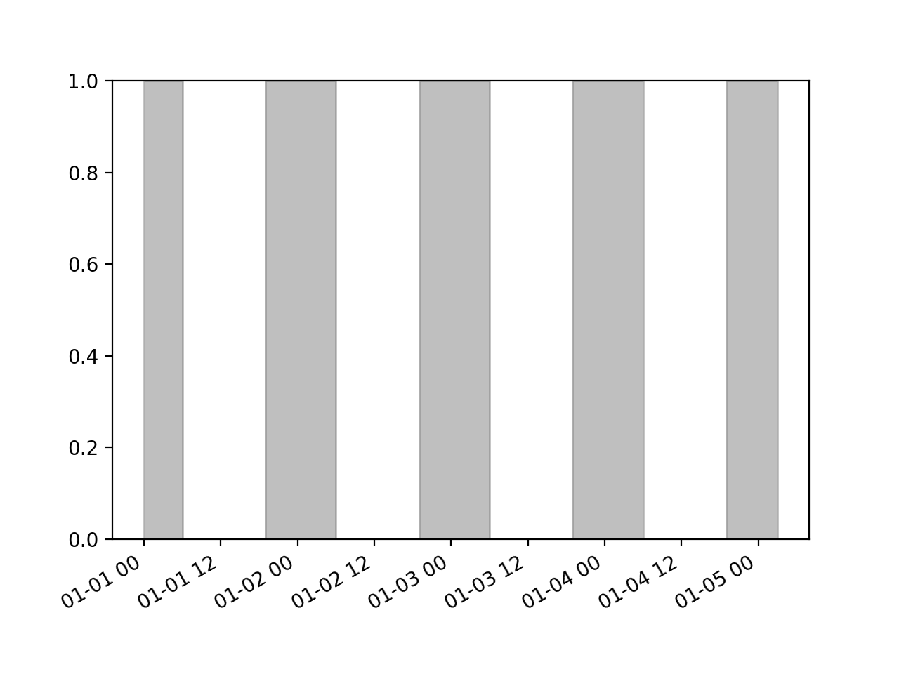

# Nightshade

### Shade nighttime dark on plots

### Install

`pip install shader`

### Usage

```python
import shader; import pandas as pd

# create timeseries
idx = pd.date_range("2018-01-01", periods=100, freq="H")
ts = pd.Series(range(len(idx)), index=idx)

# shade 
import shader
shader.shade(ts)

# plot
import matpotlib.pyplot as plt
plt.show()
```

